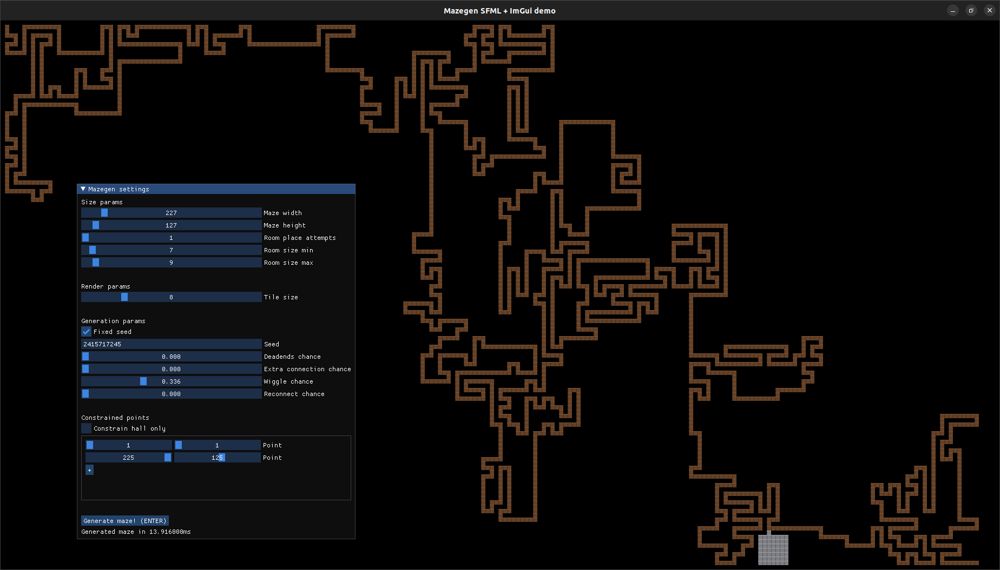

# Mazegen SFML + ImGui demo 

Demo program for the Mazegen library https://github.com/aleksandrbazhin/mazegen.   
Mazegen is a maze generation library based on Bob Nystrom's approach, decribed here https://journal.stuffwithstuff.com/2014/12/21/rooms-and-mazes/  
Binaries for Windows can be found on itch.io: https://aleksandrbazhin.itch.io/mazegen-maze-generator


## Compilation
Build system is CMake. All dependcies except SFML are used as git submodules.

### SFML
SFML has to be installed somwhere in your system. It can be done with your system package manager or by adding to `CMakeLists.txt` a line 
```
set(SFML_DIR "{path to SFML on your system}/lib/cmake/SFML")
```
before the line
```
find_package(SFML ...
```

### Others
Theese are `ImGui`, `ImGui-SFML`, and `mazegen`. Run
```
git submodule update --init --remote
```

### Compilation with CMake
```
mkdir build && cd build
cmake ..
cmake --build .
```
Should produce `mazegen-sfml` executable in the `build/` directory.

## Algorithm and UI parameters

Refer to https://github.com/aleksandrbazhin/mazegen readme for more details on the algorithm.

The algorithm in short:
1. Throws rooms randomly `Room place attempts` times. If the room overlaps others it is skipped`.
2. Grows the maze by random walk, wiggling with a `wiggle chance`, from every point. Unlike the original it has user-defined `constraints` which are first to be used as growth starting points.
3. Connects rooms to all the adjacent halls by the doors once. Each hall region is connected at least once.
4. If the room is connected to an already connected region, the door is removed with `1.0f - extra connection chance`.  Unlike the original, there is no flood fill to test for connectivity, instead union-find is used for maze regions.
5. Deadends are removed with `1.0f - deadend chance`. If `deadend chance` is 0, the maze just connects all the constraints and the rooms without any blind halls.
6. Deadends adjacent to the rooms are connected with `reconnect deadends chance`. This step is not in the original, but leads to a more natural looking maze - who would build a hall close to the room and not build a door?


## Roadmap
- Export generate maze as a texture or json
- Render doors and constrained points
- Fine controls for ImGui slider
## Screens 





